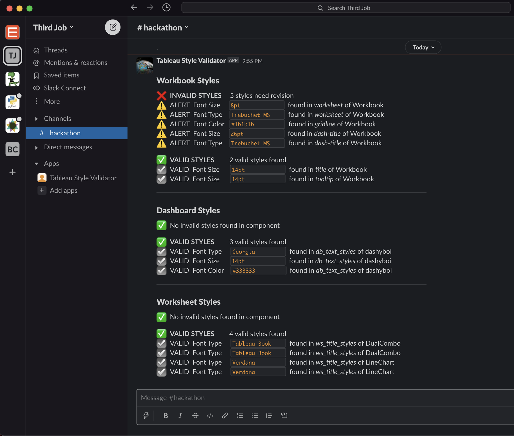

# Tableau Style Validator
> Check dashboards for consistency with your organization's style standards. Monitor dashboards in realtime via cloud deployment or test files locally via command line interface. [Watch demo video on YouTube.](https://www.youtube.com/watch?v=4to2ln6pME8)

    

🏆 [Tableau #DataDev Hackathon](https://datadev-hackathon.devpost.com/project-gallery) Winner, Third Place  

# Overview
The Tableau Style Validator tests a Tableau Workbook for compliance with a given set of design style standards. Company colors, specific fonts, font sizes are the primary scope, but dashboard styles like Borders, Margins, Padding, Backgrounds, etc are testable as well.

In the full cloud deployment, Tableau Style Validator is triggered by a new Tableau Workbook being created 
or updated on your Tableau Server. This returns the validation as a Slack message via Slack Bot to a specified channel in your Slack Workspace. 

The tool can also be used locally from the command line. This is a great way to get started and see if it makes sense for you to set up the cloud deployment. Scroll down to the Quick Start section to try it out for yourself.

<figure>
    
    <figcaption>Receive alerts about invalid styles via Slack</figcaption>
</figure>

# Quick Start
All instructions assume macOS and that you have [Homebrew](https://brew.sh/) and `git` installed and tries not to assume anything else. Let me know if I overlooked anything or if you run into any troubles getting set up using these instructions.

The below steps create an isolated Python environment to quickly test the program from your command line. 

### 1. Clone Repository
- `$ mkdir tableau-style-validator`
- `$ cd tableau-style-validator`
- `$ git clone https://github.com/bcrant/tableau-style-validator.git` 

### 2. Prepare Python
Install the Python version manager `pyenv`
- `$ brew install pyenv`
- `$ brew install pyenv-virtualenv`
  
Download the Python version used in this project.
- `$ pyenv install 3.8.10`
- `$ pyvenv local 3.8.10`

Create a virtual environment for this project using that Python version.
- `$ pyenv virtualenv 3.8.10 tableau_style_validator`
- `$ pip install --upgrade pip`
- `$ pip install -r requirements-cli.txt`

### 3. Run Demo
That's it! You can now run `validator_cli.py` using the example Style Guide and Workbook in the 
["tests" directory](./tests) of this repository using this command:

`$ python validator_cli.py -s ./tests/example_style_guide.json -w ./tests/example_workbook.twb`

Here is a screenshot of the expected output of this command for reference...

# Usage
### How to Run the Tableau Style Validator as a Command Line Interface

After completing step three of the Quick Start guide, you will be ready to use the Tableau Style Validator with your own files.

First, create a copy of the [Example Style Guide](./tests/example_style_guide.json) and edit accordingly to your desired style standards. 
  
You can do this via command line from your project directory by running...

`$ cp ./tests/example_style_guide.json ./your_style_guide.json`  
`$ vim your_style_guide.json` or use your preferred text editor

Next, you will just need to move any Tableau Workbook (.twb) or Packaged Workbook (.twbx) that you wish to test into your project directory.

Adjust the paths in this command to point to the files you've just added, and you're ready to go!

`$ python validator_cli.py -s ./your_style_guide.json -w ./your_workbook.twb`

# Cloud Deployment
View [SETUP.md](./documentation/SETUP.md) documentation for an in depth walk through of the cloud deployment, hosted on all free tier AWS products.

# Project To Do's:
- Add Slack formatting to Dashboard Zones (borders, margins, padding)
    - Update the SlackAlerts class string formatting in 
      [alerts_slack_fmt.py](./lib/alerts_slack_fmt.py)
    - Update code block beginning line 314 of 
      [validate_styles.py](./lib/validate_styles.py) 
- Worksheet styles do not appear to be deduping styles correctly
- Add flags to enable / disable testing against certain elements (padding, margins, etc)
    - Quick fix would be to use a placeholder word in `style_guide.json`
      and add to conditional tests in [validate_styles.py](./lib/validate_styles.py)

# Contributing  
Pull requests are welcome. For major changes, please open an issue first to discuss what you would like to change.  

# License  
  

# Authors
Main authors:  
Brian Crant &emsp;|&emsp; < brian@briancrant.com > &emsp;|&emsp; [LinkedIn](https://www.linkedin.com/in/briancrant/)

  
<figure>
    
</figure>

  