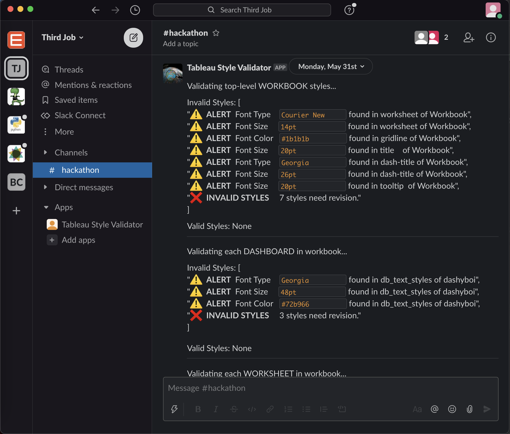
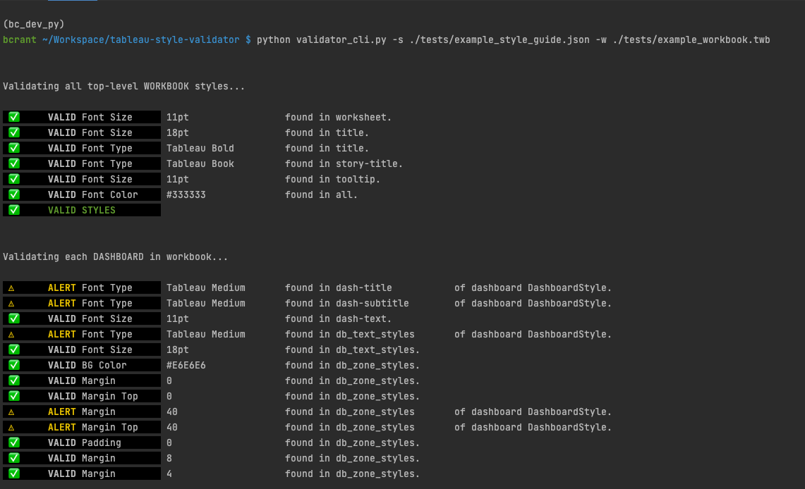
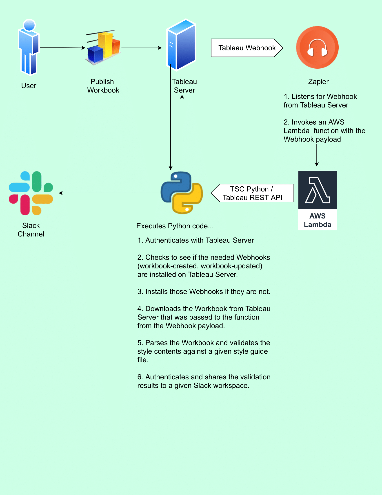

# Tableau Style Validator

  

🏆 [Tableau #DataDev Hackathon](https://datadev-hackathon.devpost.com/project-gallery) Winner, Third Place

Check dashboards for consistency with your organization's style standards. Monitor dashboards in realtime via cloud deployment or test files locally via command line interface. [Watch demo video on YouTube.](https://www.youtube.com/watch?v=4to2ln6pME8)

  

<i>Receive alerts about invalid styles via Slack</i>

<a href="https://paypal.me/briancrant?locale.x=en_US"></img></a>

# Quick Start
All instructions assume MacOS and that you have [Homebrew](https://brew.sh/) and `git` installed and tries not to assume anything else. Let me know if I overlooked anything or if you run into any troubles getting set up using these instructions.

See [documentation](./documentation) for an in depth walk through of the cloud deployment, hosted on all free tier AWS products.

The below steps create an isolated Python environment to quickly test the program from your command line. 

### 1. Clone Repository
- `$ mkdir tableau-style-validator`
- `$ cd tableau-style-validator`
- `$ git clone https://github.com/bcrant/tableau-style-validator.git` 

### 2. Prepare Python
Install the Python version manager `pyenv`
- `$ brew install pyenv`
- `$ brew install pyenv-virtualenv`
  
Download the Python version used in this project.
- `$ pyenv install 3.8.10`
- `$ pyvenv local 3.8.10`

Create a virtual environment for this project using that Python version.
- `$ pyenv virtualenv 3.8.10 tableau_style_validator`
- `$ pip install --upgrade pip`
- `$ pip install -r requirements-cli.txt`

### 3. Run Demo

That's it! You can now run `validator_cli.py` using the example Style Guide and Workbook in the 
["tests" directory](./tests) of this repository using this command:

`$ python validator_cli.py -s ./tests/example_style_guide.json -w ./tests/example_workbook.twb`

Here is a screenshot of the expected output of this command for reference...

# Usage 

After completing step three of the Quick Start guide, you will be ready to use the Tableau Style Validator with your own files.

First, create a copy of the [Example Style Guide](./tests/example_style_guide.json) and edit accordingly to your desired style standards. 
  
You can do this via command line from your project directory by running...

`$ cp ./tests/example_style_guide.json ./your_style_guide.json`  
`$ vim your_style_guide.json` or use your preferred text editor

Next, you will just need to move any Tableau Workbook (.twb) or Packaged Workbook (.twbx) that you wish to test into your project directory.

That's it! You're ready to rock.

  

# How Does the Cloud Deployment Work?

