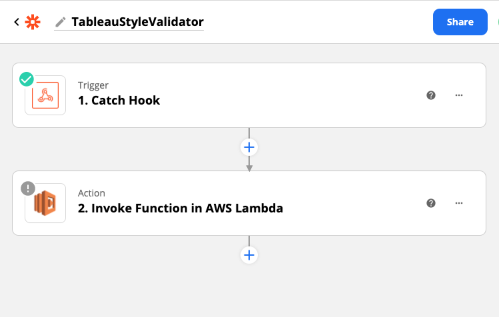

# Tableau Style Validator

  

Check dashboards for consistency with your organization's style standards.

Monitor dashboards in realtime via [cloud deployment](lambda-code) or test files locally via [command line interface](validator_cli.py).

*Receive alerts about invalid styles via Slack*
  

### [Watch demo video on YouTube](https://www.youtube.com/watch?v=4to2ln6pME8)

## Installation Preview / Summary
1. Clone the Tableau Style Validator repository
2. AWS steps…
    - Make account…
    - Make Lambda Function with Python 3.8 runtime
    - Make S3 Bucket
3. Zapier steps…
    - Uses a “Premium Connection” (AWS Lambda)
    - Start a free 7-day trial to test…
    - Create a new “Zap”...

  

- Trigger: 1. Catch Hook
    - Add “Custom Webhook URL” to .env
    - Test Trigger (requires you to have webhooks installed on your server) (can do this by running the download_workbook.py script in repo.
- Action: 2. Invoke Function in AWS Lambda
    - will need to have made the (aws account) and lambda function
    - Select function
    - for arguments:
        - RESOURCE_LUID
    
4. Slack steps…
    - Create a new [Slack App for your workspace](https://api.slack.com/apps)
    - Go to OAuth & Permissions —> Scopes —> Bot Token Scopes
    - Add an OAuth Scope…
        - chat:write
        - chat:write.customize
    - Install your Slack Bot to your workspace.
        - Add the Slack Bot User OAuth Access Token to `.env`
    - Add the channel you want to post to in `.env` (You can use a test one for now and change this later)
    - IMPORTANT: Add the slack bot to the channel you will be posting to by running Slack command: `/invite @BOT_NAME`
