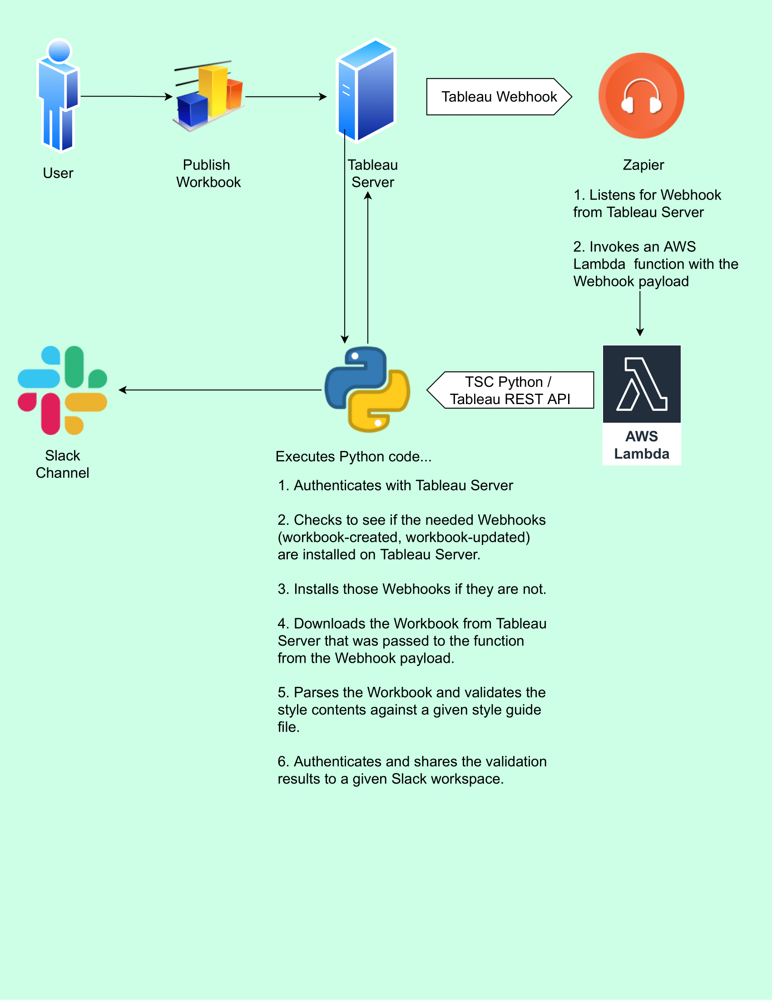

# Tableau Style Validator Setup and Cloud Deployment
All instructions assume macOS and that you have [Homebrew](https://brew.sh/) and `git` installed and tries not to assume anything else. Let me know if I overlooked anything or if you run into any troubles getting set up using these instructions.

# Overview
Before diving into the specifics, let's take a look at the project architecture...  

# Setup
### 1. Clone Repository
- `$ mkdir tableau-style-validator`
- `$ cd tableau-style-validator`
- `$ git clone https://github.com/bcrant/tableau-style-validator.git` 

### 2. Prepare Python
Install the Python version manager `pyenv`
- `$ brew install pyenv`
- `$ brew install pyenv-virtualenv`
  
Download the Python version used in this project.
- `$ pyenv install 3.8.10`
- `$ pyvenv local 3.8.10`

Create a virtual environment for this project using that Python version.
- `$ pyenv virtualenv 3.8.10 tableau_style_validator`
- `$ pip install --upgrade pip`
- `$ pip install -r requirements-cli.txt`

# Cloud Deployment Prerequisites / Setup
1. AWS steps…
    - Make account
    - Make Lambda Function with Python 3.8 runtime
    - Make S3 Bucket
2. Zapier steps…
    - Uses a paid “Premium Connection” (AWS Lambda)
    - Start a free 7-day trial to test…
    - Create a new “Zap”...

  

- Trigger: 1. Catch Hook
    - Add “Custom Webhook URL” to .env
    - Test Trigger (requires you to have webhooks installed on your server) (can do this by running the download_workbook.py script in repo.
- Action: 2. Invoke Function in AWS Lambda
    - will need to have made the (aws account) and lambda function
    - Select function
    - for arguments:
        - RESOURCE_LUID
    
4. Slack steps…
    - Create a new [Slack App for your workspace](https://api.slack.com/apps)
    - Go to OAuth & Permissions —> Scopes —> Bot Token Scopes
    - Add an OAuth Scope…
        - chat:write
        - chat:write.customize
    - Install your Slack Bot to your workspace.
        - Add the Slack Bot User OAuth Access Token to `.env`
    - Add the channel you want to post to in `.env` (You can use a test one for now and change this later)
    - IMPORTANT: Add the slack bot to the channel you will be posting to by running Slack command: `/invite @BOT_NAME`

## Cloud Deployment
(Get AWS deps native to AWS Lambda Linux Server for local use)
- `cd cloud-deployment && pip install -r ./requirements-aws-env.txt`

(Get deps served as Lambda Layer in remote for local use)
- `cd lambda-deps && pip install -r ./requirements-deps.txt`

## Prepare Docker
 - Visit https://hub.docker.com/editions/community/docker-ce-desktop-mac/ and download the Docker.dmg.
 - Install & Run Docker.dmg
 - Make sure the docker whale is running in the system bar.

## Setup IAM Execution Role
To create an execution role...
* Open the roles page in the IAM console.
* Choose Create role.
* Create a role with the following properties.
  * Trusted entity – `Lambda`.
  * Permissions – `AWSLambdaVPCAccessExecutionRole`.
  * Role name – `lambda-vpc-role`.
